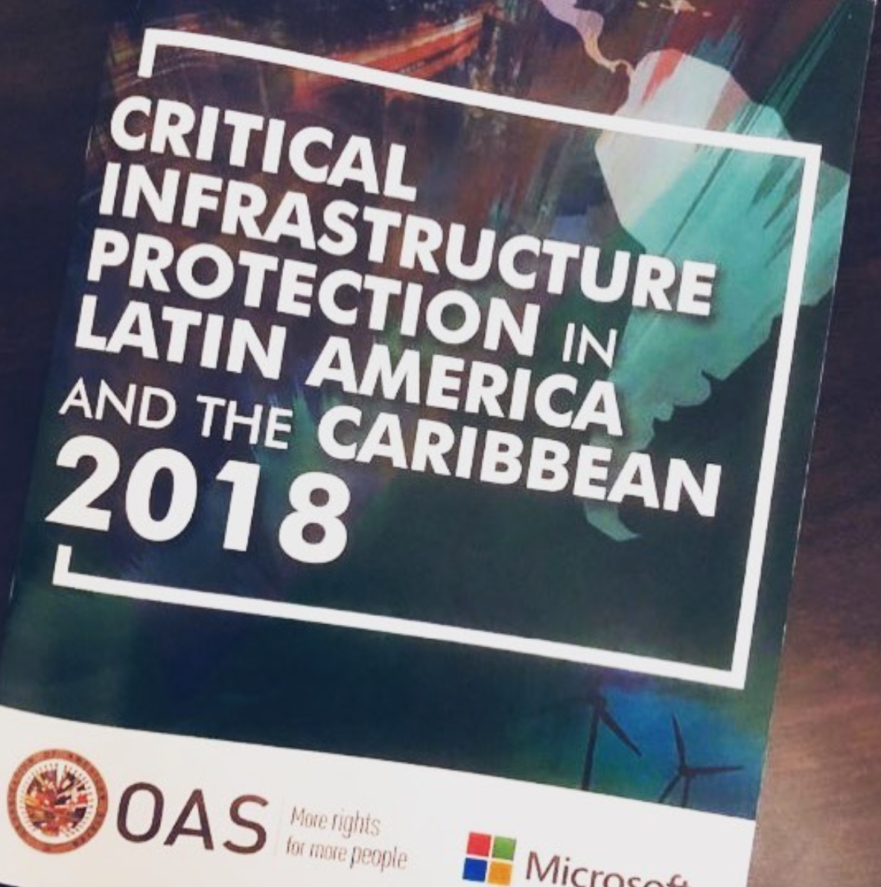
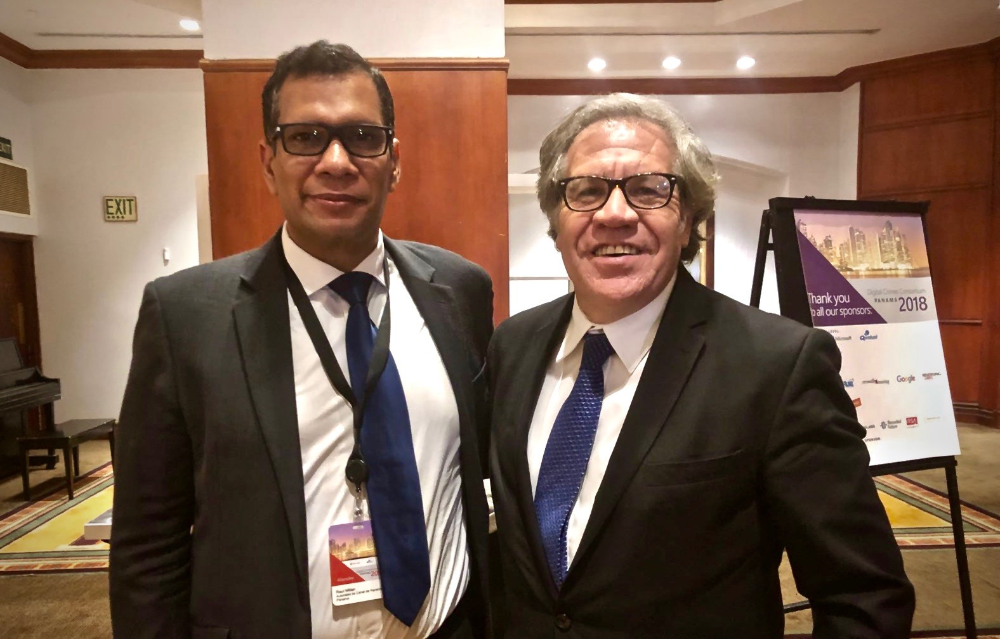

El año pasado tuve la oportunidad de aportar a este informe anual realizado Organización de Estados Americanos (OEA), este año en cooperación con Microsoft.

En dicho informe se detallan los mayores retos presentes hoy en día para la protección de infraestructuras críticas en nuestra región del mundo, entre estos están:

1. La interconexión global (el WEF le llama hiperconectividad – (https://www.weforum.org/agenda/2012/02/hyperconnectivity-the-buzz-word-at-davos/)[https://www.weforum.org/agenda/2012/02/hyperconnectivity-the-buzz-word-at-davos/]
2. Falta de capacidad para la medición del impacto y perdida de infraestructura crítica
3. Responsabilidad dispersa.

También hace un recuento de las mejores practicas a nivel global y nos muestra la región en números, generados a partir de entrevistas y aportes de diferentes personas con responsabilidad en las practicas de protección de infraestructuras críticas.

Pueden descargar una copia del reporte en el siguiente enlace: (https://www.oas.org/es/sms/cicte/cipreport.pdf)[https://www.oas.org/es/sms/cicte/cipreport.pdf]

El bono de este trabajo, es que pude conocer al Secretario General Almagro.

