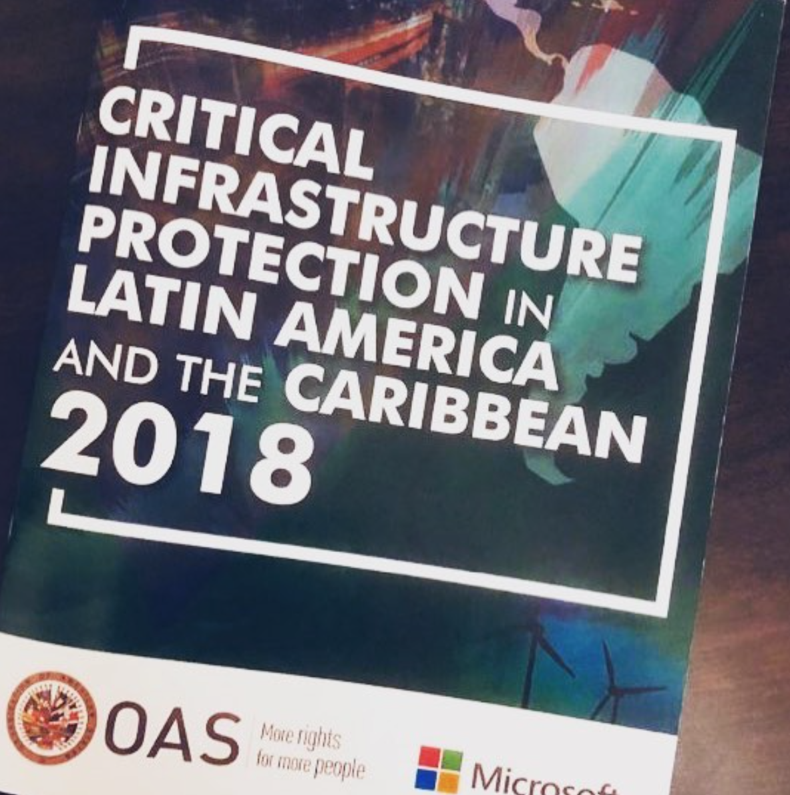
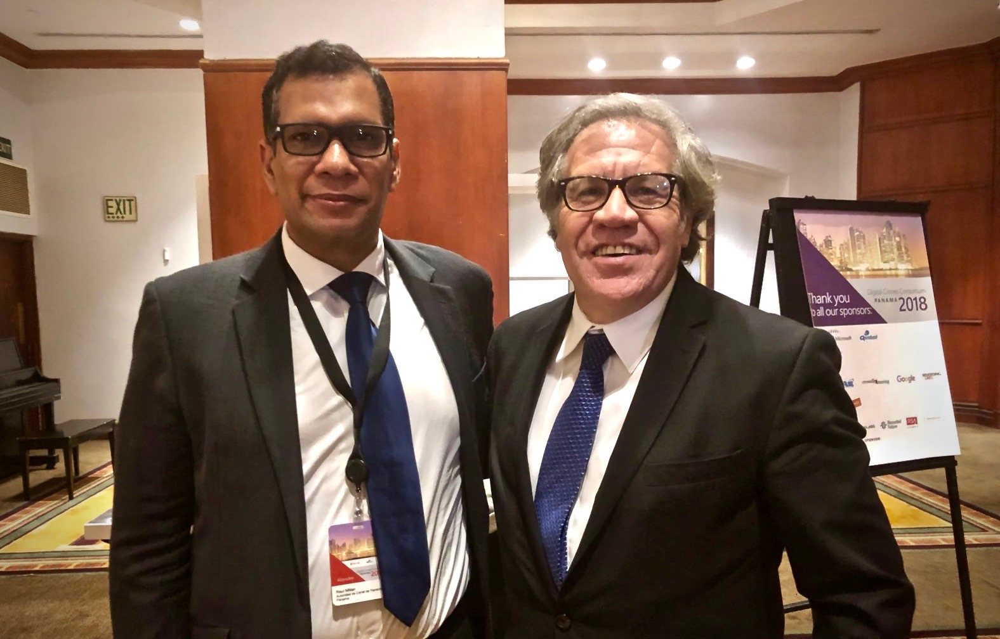

Last year, I had the opportunity to contribute to this annual report produced by the Organization of American States (OAS), this year in cooperation with Microsoft.

In this report, the major challenges present today for the protection of critical infrastructure in our region of the world are detailed. Among these are:

1. Global interconnection (the WEF calls it hyperconnectivity – [https://www.weforum.org/agenda/2012/02/hyperconnectivity-the-buzz-word-at-davos/](https://www.weforum.org/agenda/2012/02/hyperconnectivity-the-buzz-word-at-davos/)
2. Lack of capacity to measure impact and loss of critical infrastructure
3. Dispersed responsibility.

It also takes a count of best practices at the global level and shows us the region in numbers, generated from interviews and contributions from different people with responsibility in critical infrastructure protection practices.

You can download a copy of the report at the following link: [https://www.oas.org/es/sms/cicte/cipreport.pdf](https://www.oas.org/es/sms/cicte/cipreport.pdf)

The bonus of this work is that I was able to meet with Secretary General Almagro.

