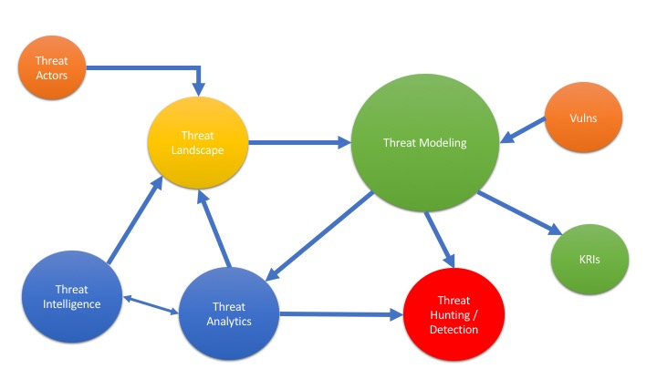

Creo que me adelante un poco con el articulo anterior sobre modelaje de amenazas; al revisitar el tema, me di cuenta de que hay muchos otros temas asociados con el modelo de amenazas, así como muchos concpetos comerciales que escuchamos todo el tiempo.

Por esta razón creo que es mejor si tratamos el tema desde un punto de vista de más alto nivel, para intentar relacionar los temas (conectar los puntos) entre los diferentes aspectos de riesgo, que se deben tener en consideración al momento de intentar hacer modelaje de amenazas.

Como aclaración, busque y busque durantes varios días algún modelo formal pre-existente, y no encontre nada que relacionara todo los temas, así que este contenido es 100% mi opinión sobre un tema complejo; estoy seguro que debe existir algún modelo formal, pero por el momento esto es lo que se me ha ocurrido.

## Definiciones:

**Threat Actors**: Son aquellos elementos que influencian de alguna manera el panorama de amenaza, estos pueden ser empleados internos disgustados (amenaza interna), naciones interesadas,  crimen organizado, hacktivistas, atacantes externos, entre otros.

**Threat Landscape**: Es una colección de amenazas, usualmente contiene las amenazas identificadas como activas, tendencias observadas y los actores involucrados. Puede ser una simple lista de las amenazas más prominentes (top 10) prioridades de acuerdo a la frecuencia de aparición y no tanto por el impacto causado.

**Threat Intelligence**: Es el resultado de un análisis basado en la identificación, colección y enriquecimiento de datos e información relevantes. Usualmente cae dentro de dos categorías 1) Inteligencia operacional (producida por máquinas y usualmente relacionada con el termino de Threat intelligence) o 2) Inteligencia estratégica (producido por analistas humanos y usualmente relacionada con el termino Threat analytics).

**Threat Analytics**: Ver inteligencia estratégica arriba. Existe una tendencia marcada a dejar la tarea de análisis en manos de las nuevas herramientas disponibles a través del uso de Inteligencia Artificial, pero el enfoque tradicional es usar analistas de seguridad.

**Threat Hunting**: Es el acto de interceptar, rastrear y eliminar, de forma agresiva, a los adversarios en las fases más tempranas del cyber kill chain, con el objetivo de interrumpir las operaciones de los atacantes. Esto es una evolución del rol pasivo de los equipos de respuesta a incidentes, hacia un modelo más pro activo, y esta basado en el supuesto que en cuanto más temprano se detecten las actividades de los atacantes, dentro de la cadena de ataque, más bajo es el impacto de dichas actividades en la organización.  Algunos beneficios son: 1) Se gana visibilidad y se descubren debilidades en su organización, 2) detección temprana de amenazas, 3) control de daños, 4) mejora de las contramedidas automaticas.

**Key Risk Indicators (KRIs)**: Son métricas capaces de mostrar si una organización es sujeto o tiene alta probabilidad de ser sujeto a un riesgo que excede el apetito de riesgo de la organización.

**Vulnerability**: Es una debilidad que puede ser explotada por un threat actor, para realizar acciones no autorizadas dentro de un sistema de computo. Para explotar la vulnerabilidad una atacante debe tener por lo menos una herramienta o técnica aplicable a la debilidad identificada. En este contexto, una vulnerabilidad también es conocida como vector/superficie de ataque.

**Threat Modeling**: Es un proceso en el cual las amenazas potenciales pueden ser identificadas, enumeradas, y asignadas una prioridad, desde un punto de vista hipotético. El propósito del modelaje de amenazas es proveer a los defensores con un análisis sistemático del perfil de los probables atacantes, identificar los vectores de ataque más probables, y los activos más deseados por los atacantes. Responde la pregunta “¿Donde están los activos más valiosos?”, “¿Donde somos más vulnerables a un ataque?”, “¿Cuales son las amenazas más relevantes?”, “¿Existe un vector de ataque que pase por desapercibido?”

## Conectando los puntos

Después de definir los términos, solo nos queda ver como se relacionan entre ellos; esto es lo que creo que debe suceder en este sentido.

Tomando en cuenta que este ecosistema sirve dos objetivos, 1) Proveer a los defensores de la información necesaria para saber donde aplicar los esfuerzos necesarios para minimizar los daños (threat modeling) y 2) proveer a la organización un mecanismo formal para la cuantificación y evaluación de riesgo cibernético (KRI).

En este contexto podemos empezar por decir que las vulnerabilidades, los actores, la información recolectada de forma automática y los analistas de seguridad, contribuyen a la definición del panorama de amenazas (threat landscape).

Luego, este panorama, más la información de los analistas, más lo que generan los equipos de respuesta a incidente o cazadores de amenazas, y las vulnerabilidades, es lo que se va a poder utilizar para modelar los riesgos cibernéticos (se puede usar STRIDE en este punto).

Una vez tengamos claro el modelo de amenazas, entonces podemos crear los KRIs, mismos que nos sirve para traducir el riesgo tecnológico a términos más potables para los tomadores de decisiones de negocio.

Cualquier modelo de amenazas que le falte alguno de estos componentes, estará incompleto y no podrá producir indicadores de riesgo confiable, pero más importante, podria producir un panorama de amenazas incompleto, que deje por fuera vectores de ataque importantes.

Como se podrá ver, no se trata de una sola solución de hardware o software, se trata de un proceso de negocios, embebido dentro del area o función de seguridad de la información. Es uno más de los múltiples procesos de negocio relacionados con la gestión de tecnología, mismos que no deben ser ignorados o desechados como un ejercicio académico, ya que la ausencia de estos procesos formales, son una formula para el desastre cibernético.

Estoy al tanto que existen multiples modelos o formas de ver este tema, por ejemplo, me mandaron un documento de SANS ([https://www.sans.org/security-resources/posters/cyber-threat-intelligence-consumption/130/download](https://www.sans.org/security-resources/posters/cyber-threat-intelligence-consumption/130/download)) que habla de este tema, pero desde la perspectiva académica y con los términos usualmente relacionados con SANS, pero la realidad es que los términos que comúnmente se escuchan por parte de los proveedores y multiples fuentes de información, como Gartner, no siempre son los mismos utilizados por SANS, lo que hace algo difícil la correlación entre lo que se explica en los cursos y lo que ocurre en el mundo real.

Como siempre, les recuerdo que esta es mi percepción sobre el tema, y que espero haber acertado en la mayoría de los temas, pero no pretendo tener el conocimiento absoluto del mismo, por lo que les pido que me envíen sus comentarios.

Voy a estar haciendo otros posts relacionados con cada uno de los términos utilizados en este articulo, para tratar de ponerle un ejemplo del mundo real a cada uno y así poder realizar una mejor conexión entre los temas.