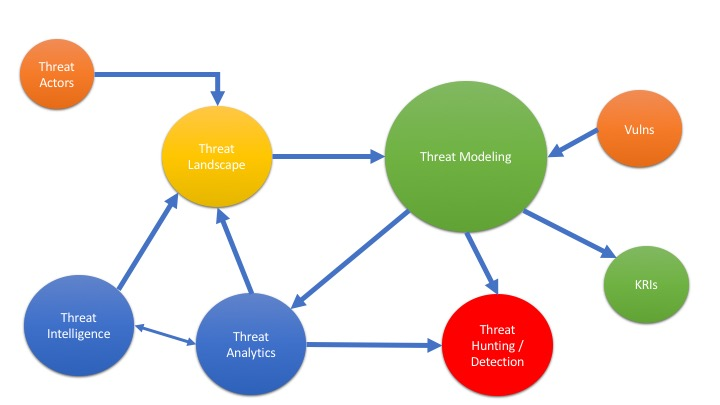

I think I got ahead of myself a bit with the previous article on threat modeling. When I revisited the topic, I realized that there are many other topics associated with the threat model, as well as many commercial concepts that we hear all the time.

For this reason, I think it is better if we approach the topic from a higher-level point of view to try to relate the topics (connect the dots) between the different aspects of risk that should be considered when attempting to do threat modeling.

As a disclaimer, I searched for several days for some pre-existing formal model and could not find anything that related all the topics. So this content is 100% my opinion on a complex topic. I am sure there must be some formal model out there, but for now, this is what I have come up with.

## Definitions:

**Threat Actors**: These are elements that influence the threat landscape in some way. These can be disgruntled internal employees (internal threat), interested nations, organized crime, hacktivists, external attackers, among others.

**Threat Landscape**: It is a collection of threats, usually contains threats identified as active, observed trends, and the actors involved. It can be a simple list of the most prominent threats (top 10) prioritized according to frequency of appearance rather than impact caused.

**Threat Intelligence**: It is the result of analysis based on the identification, collection, and enrichment of relevant data and information. Usually falls into two categories: 1) Operational Intelligence (produced by machines and usually related to the term Threat Intelligence) or 2) Strategic Intelligence (produced by human analysts and usually related to the term Threat Analytics).

**Threat Analytics**: See Strategic Intelligence above. There is a marked trend to leave the analysis task to the new tools available through the use of Artificial Intelligence. However, the traditional approach is to use security analysts.

**Threat Hunting**: It is the act of intercepting, tracking, and aggressively eliminating adversaries in the earliest phases of the cyber kill chain with the goal of disrupting attacker operations. This is an evolution from the passive role of incident response teams toward a more proactive model and is based on the assumption that the earlier attacker activities are detected in the attack chain, the lower the impact on the organization. Some benefits are: 1) Gain visibility and discover weaknesses in your organization, 2) Early detection of threats, 3) Damage control, 4) Improvement of automated countermeasures.

**Key Risk Indicators (KRIs)**: These are metrics capable of showing whether an organization is subject to or has a high probability of being subject to a risk that exceeds the organization's risk appetite.

**Vulnerability**: It is a weakness that can be exploited by a threat actor to perform unauthorized actions within a computer system. To exploit the vulnerability, an attacker must have at least one tool or technique applicable to the identified weakness. In this context, a vulnerability is also known as an attack vector/surface.

**Threat Modeling**: It is a process in which potential threats can be identified, enumerated, and assigned a priority from a hypothetical point of view. The purpose of threat modeling is to provide defenders with a systematic analysis of the profile of probable attackers, identify the most probable attack vectors, and the assets most desired by attackers. It answers the questions: "Where are the most valuable assets?", "Where are we most vulnerable to attack?", "What are the most relevant threats?", "Is there an attack vector that goes unnoticed?"

## Connecting the Dots

After defining the terms, all that remains is to see how they relate to each other. This is what I believe should happen in this regard.

Taking into account that this ecosystem serves two objectives: 1) Provide defenders with the information they need to know where to apply the necessary efforts to minimize damage (threat modeling) and 2) Provide the organization with a formal mechanism for quantifying and evaluating cybersecurity risk (KRI).

In this context, we can start by saying that vulnerabilities, actors, information collected automatically, and security analysts all contribute to the definition of the threat landscape.

Then, this landscape, plus information from analysts, plus what incident response teams or threat hunters generate, and vulnerabilities, is what will be used to model cybersecurity risks (STRIDE can be used at this point).

Once we have the threat model clear, then we can create the KRIs, which serve us to translate technological risk into more palatable terms for business decision-makers.

Any threat model that lacks one of these components will be incomplete and will not be able to produce reliable risk indicators. More importantly, it could produce an incomplete threat landscape that leaves out important attack vectors.

As you can see, it is not about a single hardware or software solution. It is about a business process embedded within the information security function or area. It is one of the multiple business processes related to technology management that should not be ignored or discarded as an academic exercise. The absence of these formal processes is a formula for cybersecurity disaster.

I am aware that there are multiple models or ways to view this topic. For example, someone sent me a SANS document ([https://www.sans.org/security-resources/posters/cyber-threat-intelligence-consumption/130/download](https://www.sans.org/security-resources/posters/cyber-threat-intelligence-consumption/130/download)) that talks about this topic from an academic perspective and with terms usually related to SANS. However, the reality is that the terms commonly heard from vendors and multiple sources of information, such as Gartner, are not always the same as those used by SANS, making it somewhat difficult to correlate what is explained in courses with what happens in the real world.

As always, I remind you that this is my perception of the topic and I hope I got it right in most areas. However, I do not claim to have absolute knowledge of it, so I ask that you send me your comments.

I will be making other posts related to each of the terms used in this article to try to give a real-world example to each one and thus be able to make a better connection between the topics.
