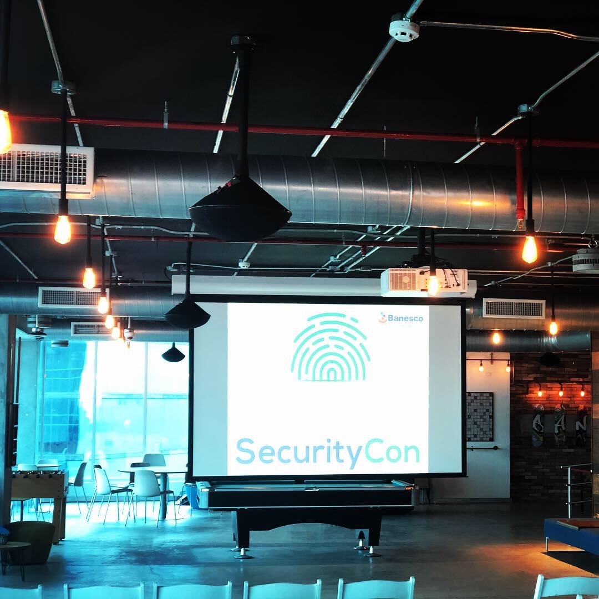
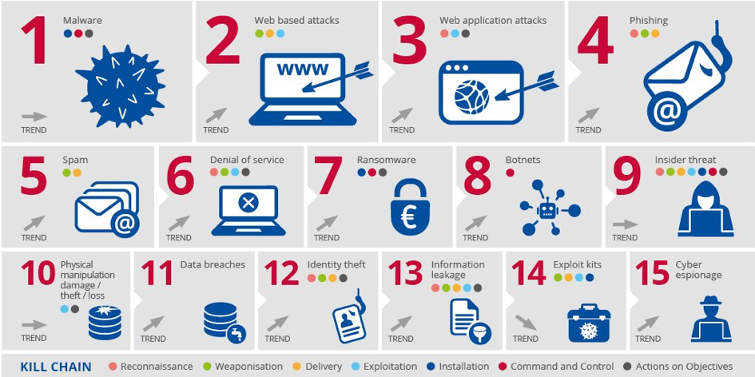

En días pasado Banesco me invito cómo expositor a su evento interno de seguridad, SecuriCon; creo que es una buena iniciativa, tanto para la concienciación del personal interno del banco, así como para compartir con los pares los temas de actualidad.

Para dicha presentación decidí hacer algo así como un cierre para el tema de gestión de amenazas. En posts pasados, ya vimos los modelos existentes para documentar/clasificar amenazas, y también revise las relaciones de las diferentes actividades dentro del ecosistema de amenazas.

Creo que un buen cierre para el tema, es ¿cómo aplicamos esto a la vida real? o ¿cuál es el rol del oficial de seguridad frente a la gestión de amenazas?

Desde que puedo recordar, el rol del oficial de seguridad de la información o encargado de la oficina de seguridad (a.k.a CISO), ha sido uno de conflictos y divisiones; originadas principalmente por los objetivos de dichas unidades, o a veces por la falta de objetivos. En una organización típica, usualmente tenemos por un lado tenemos el objetivo con el que más estamos familiarizados, que es el de aseguramiento; es decir, la aplicación y operación de controles de seguridad en los sistemas de TI (firewall, antivirus, webfilter, etc.). Esto no nos hace las personas favoritas dentro de los departamentos de operaciones de TI, pero es a lo que más estamos acostumbrados.

Más recientemente, el segundo objetivo ha tomado relevancia, dicho objetivo es el de cumplimiento. El hecho de estar alejados de los países de primer mundo, donde la regulación es una de las herramientas más utilizadas por los gobiernos y entidades privadas, para intentar garantizar la operación de las organizaciones, dentro de marco aceptable de riesgo; nos hace un poco insensibles a la necesidad de alinearnos con ciertos estándares o regulaciones.

Con esto quiero decir, que usualmente, las unidades de seguridad de la información, no de asignan la prioridad correcta al objetivo de cumplimiento, generando estrés entre los encargados de hacer cumplir las normas (auditores/fraude) y las unidades operativas de TI y de seguridad.

En ciertos casos, esto puede ocasionar un sobre calentamiento de las relaciones, y la carrera típica por tratar de cumplir a costa de las tareas operativas regulares (aseguramiento), sacrificando el objetivo de aseguramiento.

Este desbalance entre ambos objetivos (aseguramiento y cumplimiento), genera retrasos en la entrega de proyectos, entrega de proyectos de manera insegura, fricción innecesaria entre las diferentes unidades (desarrollo, operaciones, soporte y seguridad), y en términos generales, un ambiente negativo para ejecutar la función de seguridad de la información.

Si a esto sumamos el hecho de que la función de seguridad de la información no tiene definido su objetivo de manera clara y formal, desde su inicio, tendríamos que agregar a lo antes señalado, una crisis de identidad de la unidad responsable de la seguridad de la información; situación donde no se tiene claro el rol máximo de dicha unidad.

Esto provoca el famoso “estamos muy ocupados en el día a día”, o mejor conocido en inglés como el “fire fighting mode”. Siempre de una emergencia a otra emergencia, siempre cansados y siempre con trabajo acumulado.

En el libro “The Phoenix Project”,  a esta situación se le llama el ““never-ending hamster wheel of pain” donde la unidad de seguridad de la información llena los buzones de la unidad de operaciones de TI con listas interminables de trabajo de remediación “urgente”, periodo tras periodo.

Describir esta situación es necesario para poder entender la relación entre aseguramiento, cumplimiento y lo que debería ser el trabajo principal de las unidades de seguridad de la información, que no es más que gestión de amenazas.

Si de un lado tenemos las obligaciones del aseguramiento de la información e infraestructura, responsabilidad que usualmente le corresponde a operaciones de TI, y por otro lado tenemos la presión generada por los requisitos de cumplimiento, que usualmente emanan de los departamentos de auditoria interna. Entonces, podemos decir que en medio de estas dos actividades esta la gestión de amenazas como rol primordial de las unidades de seguridad de la información.

Las actividades que se realizan alrededor de la gestión de amenazas, conforman el ecosistema de amenazas; y tienen como resultado final, indicadores claros de riesgo, que pueden ser asociados de manera directa, a acciones que se han tomado o tareas que se han dejado de ejecutar, relacionadas con decisiones de negocio o técnicas; sin importar la consecuencia, la relación es muy fuerte y muy clara de establecer, usando información construida de las múltiples fuentes de datos a nuestra disposición.

De este hecho, nace la idea de utilizar el concepto de gestión de amenazas para satisface los objetivos de aseguramiento y cumplimiento de manera pro-activa, demostrando con información verificable, que se están aplicando las medidas correctivas y preventivas, en los lugares o temas, que realmente son relevantes para la organización.

El resultado de llevar a cabo la función de gestión de amenazas, puede ser desplegado de forma gráfica; por ejemplo, el panorama de amenazas, publicado por ENISA para el año 2017, se ve así.

([https://www.enisa.europa.eu/publications/enisa-threat-landscape-report-2017](https://www.enisa.europa.eu/publications/enisa-threat-landscape-report-2017))

El panorama de amenazas forma parte del [ecosistemas de amenazas](https://the.raulmillan.com/2018-07-26-ecosistema/), tal como lo describí en artículos anteriores. Este resumen básicamente describe el panorama de amenazas que ENISA ha descrito para el territorio Europeo. Este mismo tipo de tableros de mando, debe existir para cada organización; donde se pueda visualizar los problemas más urgentes para atender, dandole forma a los planes directores de seguridad de la información. Estos planes despejan dudas sobre los requerimientos de presupuestos (capital y operaciones), así como los requerimientos de personal para la operación de la función de seguridad.

Por supuesto que existen modelos formales de gestión de riesgo, tales como Risk IT [http://www.isaca.org/Knowledge-Center/Risk-IT-IT-Risk-Management/Pages/default.aspx](http://www.isaca.org/Knowledge-Center/Risk-IT-IT-Risk-Management/Pages/default.aspx), o el Information Risk Assesment Methodology [https://www.securityforum.org/tool/information-risk-assessment-methodology-iram2/](https://www.securityforum.org/tool/information-risk-assessment-methodology-iram2/) del Information Secuirty Forum, sin embargo estos modelos o marcos de trabajo toca los temas de gestión de amenazas a un nivel muy alto, con un enfoque casi exclusivo en el tema de riesgo.

Aunque definir y gestionar el riesgo es el objetivo final de cualquier oficina de seguridad de la información, llegar a ese nivel de conversación con la directiva o ejecutivos, requiere un nivel de madurez a nivel organizacional, que muy probablemente no tengamos en nuestra región del mundo.

Ya de por si, hablar de gestión de amenazas suena a un ejercicio académico, ahora hablar de riesgo sonaría como ciencia ficción para muchas organizaciones. Esta realidad puede que no este presente en el sector financiero, pero fuera del ámbito financiero es muy común la percepción de que si no estamos administrando una consola, o implementando la siguiente solución mágica para detener todos los ataques cibernéticos que puedan existir, no estamos haciendo nuestros trabajos.

El hecho de que los vendedores de soluciones se enfoquen, de manera casi exclusiva, en soluciones puntuales (cajas mágicas), no ayuda a que nuestros superiores entiendan el problema en la dimensión correcta.

Muchas veces caemos en la trampa de vende miedo, incertidumbre y duda (FUD) a lo interno de nuestras organizaciones, debido a que esto es lo que nuestros proveedores nos transmiten.

Los programas de seguridad modernos deben ser orientados al negocio, basados en riesgo, orientados a la información, influenciados por la identidad, y automatizados.

Lo que llamamos programas de seguridad de legado (legacy), usualmente están orientados a TI y cumplimiento,  basados en amenazas, influenciados por los dispositivos y orientados a la infraestructura.

Los programas deben continuar enfocados en las amenazas y cumplimiento, pero el enfoque en riesgo y la información conforman otro nivel de entendimiento, que fuerza la pregunta ¿qué representa una amenaza para mi información?

La búsqueda de una respuesta a esta pregunta, usualmente representa el buscar una aguja en un pajar, lo cual es muy difícil; la mayoría de los equipos de seguridad no están lo suficientemente maduros para implementar programas de riesgo y protección de datos.

Si observan dentro de los programas legacy, hay enfoque a las amenazas, sin embargo, creo que este enfoque puede ser utilizado como un primer paso para generar la información de soporte requerida para determinar el riesgo; por ende, a pesar de ser un componente del pasado, es indispensable para desarrollar los programas de seguridad modernos.

Con esto cierro el ciclo de artículos acerca del tema de amenazas, aunque estoy seguro que estas ideas pueden generar algunas discusiones interesantes; cualquier cosa, me pueden dejar sus comentarios abajo, o hacer llegar sus mensajes por cualquiera de los medios descritos en la página de contacto