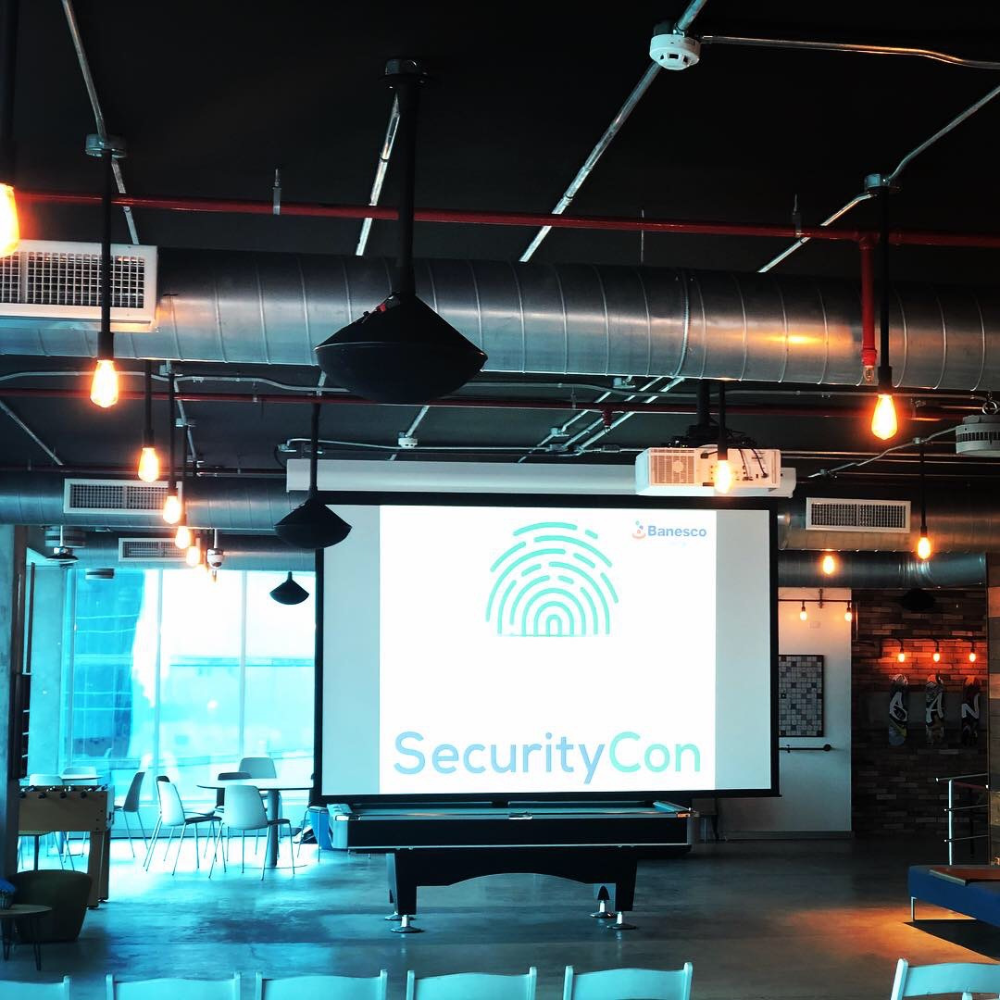
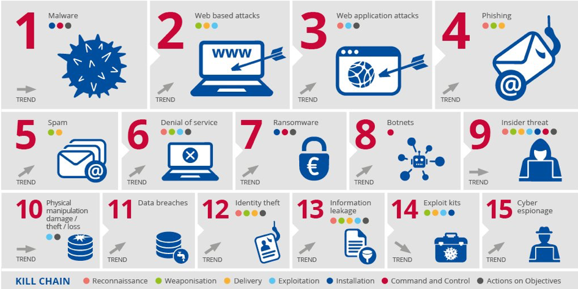

Recently, Banesco invited me as a speaker at their internal security event, SecuriCon. I think it is a good initiative, both for raising awareness among the bank's internal staff and for sharing current topics with peers.

For this presentation, I decided to make something like a closing for the threat management topic. In previous posts, we already saw the existing models for documenting/classifying threats, and I also reviewed the relationships between different activities within the threat ecosystem.

I think a good closing for the topic is: how do we apply this to real life? Or what is the role of the security officer in threat management?

Since I can remember, the role of the information security officer or head of the security office (a.k.a. CISO) has been one of conflicts and divisions, primarily caused by the objectives of these units, or sometimes by the lack of objectives. In a typical organization, we usually have, on one side, the objective we are most familiar with, which is assurance. That is, the application and operation of security controls on IT systems (firewall, antivirus, web filter, etc.). This does not make us the favorite people in IT operations departments, but it is what we are most used to.

More recently, a second objective has gained relevance: compliance. The fact that we are far from first-world countries, where regulation is one of the tools most used by governments and private entities to try to ensure that organizations operate within an acceptable risk framework, makes us somewhat insensitive to the need to align with certain standards or regulations.

What I mean by this is that usually, information security units do not assign the correct priority to the compliance objective, generating stress between those responsible for enforcing regulations (auditors/fraud) and IT and security operational units.

In certain cases, this can cause a heating of relationships and the typical race to try to comply at the expense of regular operational tasks (assurance), sacrificing the assurance objective.

This imbalance between both objectives (assurance and compliance) generates delays in project delivery, delivery of projects in an insecure manner, unnecessary friction between different units (development, operations, support, and security), and in general terms, a negative environment for executing the information security function.

If we add to this the fact that the information security function does not have its objective defined clearly and formally from its inception, we would have to add to what has been mentioned a crisis of identity of the unit responsible for information security. This is a situation where the maximum role of that unit is unclear.

This causes the famous "we are too busy day to day," or better known in English as the "fire fighting mode." Always going from one emergency to another, always tired, and always with accumulated work.

In the book "The Phoenix Project," this situation is called the "never-ending hamster wheel of pain," where the information security unit floods the IT operations unit's mailboxes with endless lists of "urgent" remediation work period after period.

Describing this situation is necessary to understand the relationship between assurance, compliance, and what should be the main work of information security units, which is nothing more than threat management.

If on one side we have the obligations of assurance of information and infrastructure, a responsibility that usually corresponds to IT operations, and on the other side we have the pressure generated by compliance requirements, which usually come from internal audit departments, then we can say that in the middle of these two activities is threat management as the primary role of information security units.

The activities that take place around threat management make up the threat ecosystem. They result in clear risk indicators that can be directly associated with actions that have been taken or tasks that have not been executed, related to business or technical decisions. Regardless of the consequence, the relationship is very strong and very easy to establish using information constructed from the multiple data sources at our disposal.

From this fact comes the idea of using the concept of threat management to satisfy the objectives of assurance and compliance proactively, demonstrating with verifiable information that the correct corrective and preventive measures are being applied in the places or topics that really matter to the organization.

The result of carrying out the threat management function can be displayed graphically. For example, the threat landscape published by ENISA for 2017 looks like this:

([https://www.enisa.europa.eu/publications/enisa-threat-landscape-report-2017](https://www.enisa.europa.eu/publications/enisa-threat-landscape-report-2017))

The threat landscape is part of the [threat ecosystem](https://the.raulmillan.com/2018-07-26-ecosistema/) as I described in previous articles. This summary basically describes the threat landscape that ENISA has described for European territory. This same type of dashboard should exist for each organization, where you can visualize the most urgent problems to address, shaping information security master plans. These plans clear up questions about budget requirements (capital and operations) as well as staffing requirements for the operation of the security function.

Of course, there are formal risk management models, such as Risk IT [http://www.isaca.org/Knowledge-Center/Risk-IT-IT-Risk-Management/Pages/default.aspx](http://www.isaca.org/Knowledge-Center/Risk-IT-IT-Risk-Management/Pages/default.aspx), or the Information Risk Assessment Methodology [https://www.securityforum.org/tool/information-risk-assessment-methodology-iram2/](https://www.securityforum.org/tool/information-risk-assessment-methodology-iram2/) from the Information Security Forum. However, these models or frameworks touch on threat management topics at a very high level, with an almost exclusive focus on risk.

Although defining and managing risk is the ultimate objective of any information security office, reaching that level of conversation with the board or executives requires a level of organizational maturity that we very likely do not have in our region of the world.

Already, talking about threat management sounds like an academic exercise. Now talking about risk would sound like science fiction to many organizations. This reality may not be present in the financial sector, but outside the financial sector, it is very common for there to be a perception that if we are not managing a console or implementing the next magic solution to stop all possible cyberattacks, we are not doing our jobs.

The fact that solution vendors focus, in an almost exclusive manner, on point solutions (magic boxes) does not help our superiors understand the problem in the correct dimension.

Many times we fall into the trap of selling fear, uncertainty, and doubt (FUD) within our organizations, because this is what our vendors transmit to us.

Modern security programs should be business-oriented, risk-based, information-focused, identity-influenced, and automated.

What we call legacy (legacy) security programs are usually IT and compliance-oriented, threat-based, device-influenced, and infrastructure-oriented.

Programs should continue to be focused on threats and compliance, but the focus on risk and information form another level of understanding that forces the question: what represents a threat to my information?

The search for an answer to this question usually represents looking for a needle in a haystack, which is very difficult. Most security teams are not mature enough to implement risk and data protection programs.

If you look at legacy programs, there is a focus on threats. However, I believe that this focus can be used as a first step to generate the supporting information required to determine risk. Therefore, despite being a component of the past, it is indispensable for developing modern security programs.

With this, I close the cycle of articles on the topic of threats, although I am sure these ideas can generate some interesting discussions. As always, you can leave your comments below or send me messages through any of the means described on the contact page.
