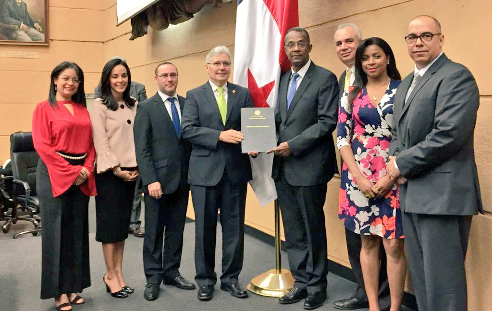

Durante el mes de Octubre el gobierno nacional anuncio la aprobación del proyecto de Ley 665, por medio del cual se regula todo lo referente con la protección de datos personales.

>[http://www.telemetro.com/nacionales/Aprueban-tercer-proyecto-proteccion-personales_0_1184582541.html](http://www.telemetro.com/nacionales/Aprueban-tercer-proyecto-proteccion-personales_0_1184582541.html)

En el contexto general de las cosas, la mayoría de la gente esta de acuerdo a que una legislación en la materia es necesaria, aunque en un país donde estamos acostumbrados a entregar nuestra identificación (cédula) con cualquier excusa (entrar a un edificio, hacer un tramite gubernamental, etc.) o peor entregar copia de dicho documento para tramites privados y públicos; puede que no entendamos la importancia de la protección de dichos datos. Sin embargo, las repercusiones de la perdida del control de nuestros datos personales, tales como robo de identidad, fraude (electrónico o no), seguridad personal (dirección, familiares, autos, etc.), no son de menospreciar.

Como casi todo en la vida, estas cosas no se hacen importantes para las personas, hasta que sufren una violación de su intimidad, son expuestos en redes sociales, o sus familiares son víctimas de fraudes o hasta secuestros virtuales.

En este sentido, esta Ley se requiere y es una necesidad innegable, además de que Panamá se encuentra muy atrasado en el tema, y debemos ponernos a tono con la comunidad internacional en las mejores practicas para tratar este tema.

Hasta ahí todo bien, sin embargo, la manera como se ha abordado el tema, y el contenido de la misma propuesta de Ley, deja bastante que desear.

A continuación un resumen de lo que he podido observar luego de leer la propuesta:

1. El texto de la ley parece dedicar más atención a explicar sus limitaciones, que las medidas de protección que se le brindan a la personal natural.
2. No se entra en detalle a explicar que son datos personales y/o qué norma internacional se utilizara para su clasificación.
3. También se restringe, o más bien, se deniega el derecho al olvido.
4. Existe una cantidad de “leyes especiales” que limitan la aplicación de esta ley, sin embargo, en ningún momento se nombran cuales son dichas leyes especiales, dejando muchas posibilidades abiertas, haciendo que sea muy difícil, sino imposible, a las personas naturales el ejercicio del derecho a la privacidad, en contravención a lo establecido en la “exposición de motivos”.

Estos son solo algunos puntos rápidos que he podido escribir por mi cuenta, en futuras publicaciones estaré entrando en materia en diferentes temas; sin embargo, vemos con preocupación como otros organismos del país han cuestionado la manera como se ha aprobado este proyecto de Ley.

>[https://www.ipandetec.org/2018/10/15/sociedad-civil-en-panama-exige-un-proceso-abierto-para-proyecto-de-ley-de-proteccion-de-datos-acelerado/](https://www.ipandetec.org/2018/10/15/sociedad-civil-en-panama-exige-un-proceso-abierto-para-proyecto-de-ley-de-proteccion-de-datos-acelerado/)

IPANDETEC, ha construido una linea de tiempo de los eventos que llevaron a la aprobación del proyecto de Ley, pueden ver la cronologia completa aquí:

[https://www.ipandetec.org/2018/01/29/cronologia-de-un-proyecto-de-ley-de-proteccion-de-datos-en-panama/](https://www.ipandetec.org/2018/01/29/cronologia-de-un-proyecto-de-ley-de-proteccion-de-datos-en-panama/)

El texto del proyecto de Ley lo pueden encontrar en el siguiente enlace (no traten de buscarlo en el sitio de la Asamblea Nacional porque no aparece):

[Haz clic para acceder a 2018_P_665.pdf](http://www.asamblea.gob.pa/proyley/2018_P_665.pdf)

Bueno, espero poder discutir esta Ley desde diferentes puntos de vista; en cuanto más opiniones me envíen pues mejor.
