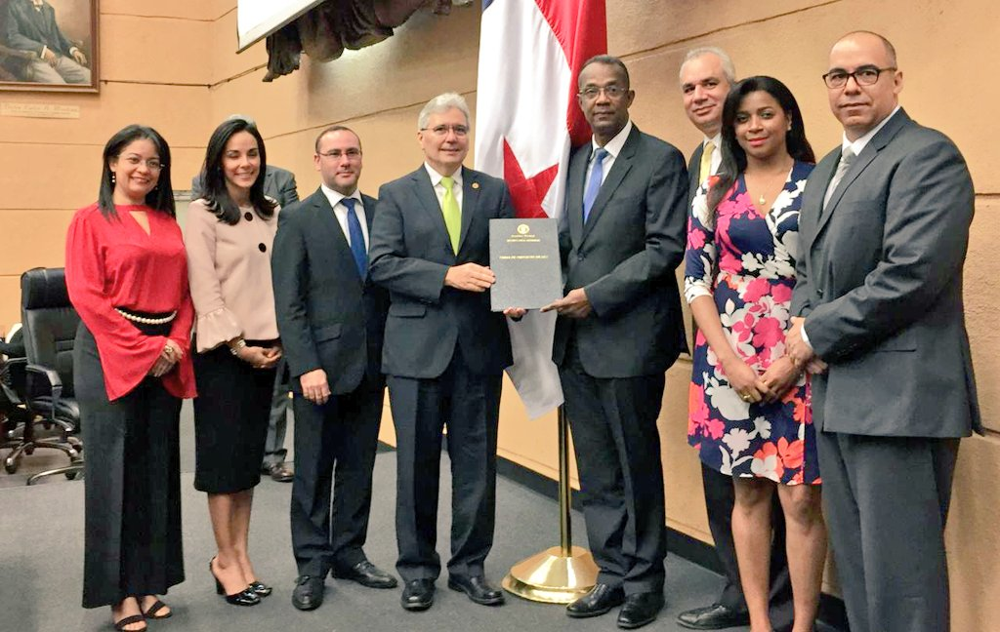

During October, the national government announced the passage of Bill 655, through which everything related to the protection of personal data is regulated.

>[http://www.telemetro.com/nacionales/Aprueban-tercer-proyecto-proteccion-personales_0_1184582541.html](http://www.telemetro.com/nacionales/Aprueban-tercer-proyecto-proteccion-personales_0_1184582541.html)

In the general context of things, most people agree that legislation on the matter is necessary. However, in a country where we are accustomed to delivering our identification (ID card) with any excuse (entering a building, doing a government procedure, etc.) or worse, delivering a copy of that document for private and public procedures, we may not understand the importance of protecting that data. Nevertheless, the repercussions of losing control of our personal data, such as identity theft, fraud (electronic or not), personal security (address, family, cars, etc.), should not be underestimated.

Like almost everything in life, these things do not become important to people until they suffer a violation of their privacy, are exposed on social networks, or their families become victims of fraud or even virtual kidnappings.

In this sense, this Law is needed and is an undeniable necessity. Moreover, Panama is very far behind on the subject and must align with the international community on best practices for treating this topic.

So far so good. However, the way the topic has been approached and the content of the Bill itself leaves much to be desired.

Below is a summary of what I have been able to observe after reading the proposal:

1. The text of the law seems to dedicate more attention to explaining its limitations than to the protection measures provided to natural persons.
2. It does not go into detail to explain what personal data is and/or what international standard will be used for its classification.
3. There is also a restriction, or rather, a denial of the right to be forgotten.
4. There are a number of "special laws" that limit the application of this law. However, at no point are these special laws named, leaving many possibilities open. This makes it very difficult, if not impossible, for natural persons to exercise the right to privacy, in contravention to what is established in the "statement of reasons."

These are just a few quick points that I have been able to write on my own. In future publications, I will be delving into different topics. However, we view with concern how other organizations in the country have questioned the way this Bill has been passed.

>[https://www.ipandetec.org/2018/10/15/sociedad-civil-en-panama-exige-un-proceso-abierto-para-proyecto-de-ley-de-proteccion-de-datos-acelerado/](https://www.ipandetec.org/2018/10/15/sociedad-civil-en-panama-exige-un-proceso-abierto-para-proyecto-de-ley-de-proteccion-de-datos-acelerado/)

IPANDETEC has built a timeline of the events that led to the passage of the Bill. You can see the complete chronology here:

[https://www.ipandetec.org/2018/01/29/cronologia-de-un-proyecto-de-ley-de-proteccion-de-datos-en-panama/](https://www.ipandetec.org/2018/01/29/cronologia-de-un-proyecto-de-ley-de-proteccion-de-datos-en-panama/)

The text of the Bill can be found at the following link (do not try to find it on the National Assembly website because it does not appear there):

[Click to access 2018_P_665.pdf](http://www.asamblea.gob.pa/proyley/2018_P_665.pdf)

Well, I hope to discuss this Law from different points of view. The more opinions you send me, the better.
