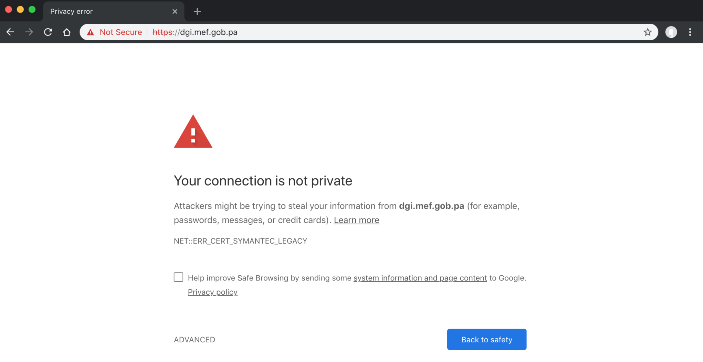

Al leer el titulo de este post muchos dirán que la pregunta no es necesaria; todos sabemos que es muy importante la seguridad, y nos la tomamos muy en serio, o por lo menos ese es el discurso que las organizaciones, tanto publicas como privadas, le dan a sus clientes o usuarios de los sistemas de información.

Estoy seguro de que para las personas que trabajan en las unidades de tecnología de las diferentes organizaciones, este tema siempre esta presente; sin embargo, los hechos muestran otra realidad.

En el capitulo más reciente de “¿Qué es seguridad de la información? y como puede ignorarla para entregar mis proyectos a tiempo”, tenemos el caso de los certificados digitales de Symantec.

TL;DR, Symantec, una ex-compañía de seguridad, cometió una de las faltas más graves en las que puede incurrir un organización: [perdida de confianza](https://wiki.mozilla.org/CA:Symantec_Issues). Esto sucedió al no controlar bien su negocio de emisión de certificados digitales y verse involucrada en la emisión de miles de certificados digitales fraudulentos, que terminaron en las manos de criminales, que los utilizaron para emprender campañas de fraude electrónico a través de todo el mundo. El resultado fue que Google y los demás fabricantes de browsers de Internet se unieran en un plan para desconfiar de los certificados digitales emitidos por Symantec, que en ese momento estaba entre los más grandes emisores de certificados, después de varias adquisiciones que incluía a Verisign.

La versión del plan Google, para desfasar el uso de certificados de Symantec, esta aqui: [https://security.googleblog.com/2017/09/chromes-plan-to-distrust-symantec.html](https://security.googleblog.com/2017/09/chromes-plan-to-distrust-symantec.html).

Regresando al tema principal de este post, parece que todas las advertencias, e-mails, chat, y conversaciones con cerveza, relacionadas con el tema, que se han sostenido a través de varios meses, con distintas personas, no han resultado, ya que el día de hoy podemos ver como el sitio del Ministerio de Economía y Finanzas de Panamá (MEF), parece haber “olvidado” actualizar sus certificados digitales, con el resultado de que su página no esta visible desde el browser Google Chrome, cosa que no seria tan grave, sino fuera por el hecho de que casi todo el planeta [utiliza](https://www.netmarketshare.com/browser-market-share.aspx?options=%7B%22filter%22%3A%7B%22%24and%22%3A%5B%7B%22deviceType%22%3A%7B%22%24in%22%3A%5B%22Desktop%2Flaptop%22%5D%7D%7D%5D%7D%2C%22dateLabel%22%3A%22Trend%22%2C%22attributes%22%3A%22share%22%2C%22group%22%3A%22browser%22%2C%22sort%22%3A%7B%22share%22%3A-1%7D%2C%22id%22%3A%22browsersDesktop%22%2C%22dateInterval%22%3A%22Monthly%22%2C%22dateStart%22%3A%222017-11%22%2C%22dateEnd%22%3A%222018-10%22%2C%22segments%22%3A%22-1000%22%7D) dicho navegador de internet (63% para ser exacto).

Como si esto no fuera suficiente, también tenemos sitios que ignoran por completo el uso de certificados digitales, a pesar de ser entidades financieras.

Debo agregar que Google Chrome es el primero en adoptar esta medida, sin embargo, se espera que el resto de los browsers sigan el mismo camino en las próximas semanas o meses.

Hoy en día el uso de certificados digitales no es algo opcional, en el sitio [https://whynohttps.com](https://whynohttps.com/), se explica con claridad el razonamiento del uso de TLS en todos los servicios web, y si gustan conocer cuales son los sitios más populares de Panamá, que aún no utilizan certificados digitales en sus páginas, puede ver aquí: [https://whynohttps.com/country/pa](https://whynohttps.com/country/pa).

Entonces, ahora la pregunta si hace más sentido: ¿Qué tan importante realmente es la seguridad de la información para nuestras organizaciones?, por las evidencias, pareciera que no esta muy arriba en la lista de prioridades de muchos, ya que existen sitios que usan certificados digitales obsoletos y/o no utilizan ningún tipo de certificado alguno.