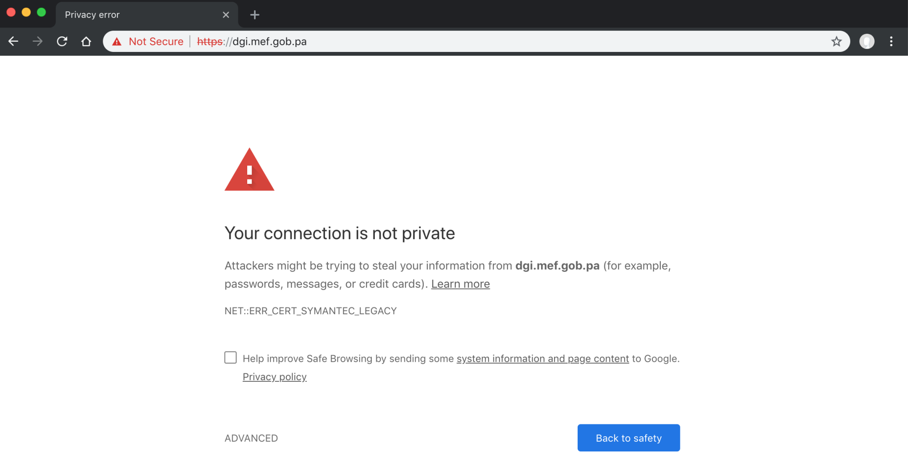

Many will say that the title of this post makes the question unnecessary when they read it. We all know that security is very important and we take it very seriously, or at least that is the discourse that both public and private organizations give to their customers or system users.

I am sure that for people working in technology units of different organizations, this topic is always present. However, the facts show another reality.

In the most recent chapter of "What is information security? And how can I ignore it to deliver my projects on time," we have the case of Symantec digital certificates.

TL;DR: Symantec, a former security company, committed one of the most serious offenses an organization can commit: [loss of trust](https://wiki.mozilla.org/CA:Symantec_Issues). This happened by not properly controlling its digital certificate issuance business and being involved in the issuance of thousands of fraudulent digital certificates that ended up in the hands of criminals, who used them to conduct electronic fraud campaigns around the world. The result was that Google and other Internet browser manufacturers united in a plan to distrust digital certificates issued by Symantec, which at that time was one of the largest certificate issuers, after several acquisitions that included Verisign.

Google's version of the plan to phase out Symantec certificate use is here: [https://security.googleblog.com/2017/09/chromes-plan-to-distrust-symantec.html](https://security.googleblog.com/2017/09/chromes-plan-to-distrust-symantec.html).

Returning to the main topic of this post, it seems that all the warnings, emails, chats, and beer conversations related to the topic that have been held over several months with different people have not worked. Today we can see how the website of Panama's Ministry of Economy and Finance (MEF) seems to have "forgotten" to update its digital certificates with the result that its website is not visible from the Google Chrome browser. This would not be so serious, if it were not for the fact that almost the entire planet [uses](https://www.netmarketshare.com/browser-market-share.aspx?options=%7B%22filter%22%3A%7B%22%24and%22%3A%5B%7B%22deviceType%22%3A%7B%22%24in%22%3A%5B%22Desktop%2Flaptop%22%5D%7D%7D%5D%7D%2C%22dateLabel%22%3A%22Trend%22%2C%22attributes%22%3A%22share%22%2C%22group%22%3A%22browser%22%2C%22sort%22%3A%7B%22share%22%3A-1%7D%2C%22id%22%3A%22browsersDesktop%22%2C%22dateInterval%22%3A%22Monthly%22%2C%22dateStart%22%3A%222017-11%22%2C%22dateEnd%22%3A%222018-10%22%2C%22segments%22%3A%22-1000%22%7D) that Internet browser (63% to be exact).

As if this were not enough, we also have websites that completely ignore the use of digital certificates, despite being financial entities.

I must add that Google Chrome was the first to adopt this measure. However, the rest of the browsers are expected to follow the same path in the coming weeks or months.

Nowadays, the use of digital certificates is not something optional. At [https://whynohttps.com](https://whynohttps.com/), the reasoning for using TLS in all web services is explained clearly. If you want to know which are the most popular websites in Panama that still do not use digital certificates on their pages, you can see here: [https://whynohttps.com/country/pa](https://whynohttps.com/country/pa).

So now the question makes more sense: How important is information security really to our organizations? Based on the evidence, it seems that it is not very high on the priority list of many, since there are websites that use obsolete digital certificates and/or do not use any type of certificate at all.
