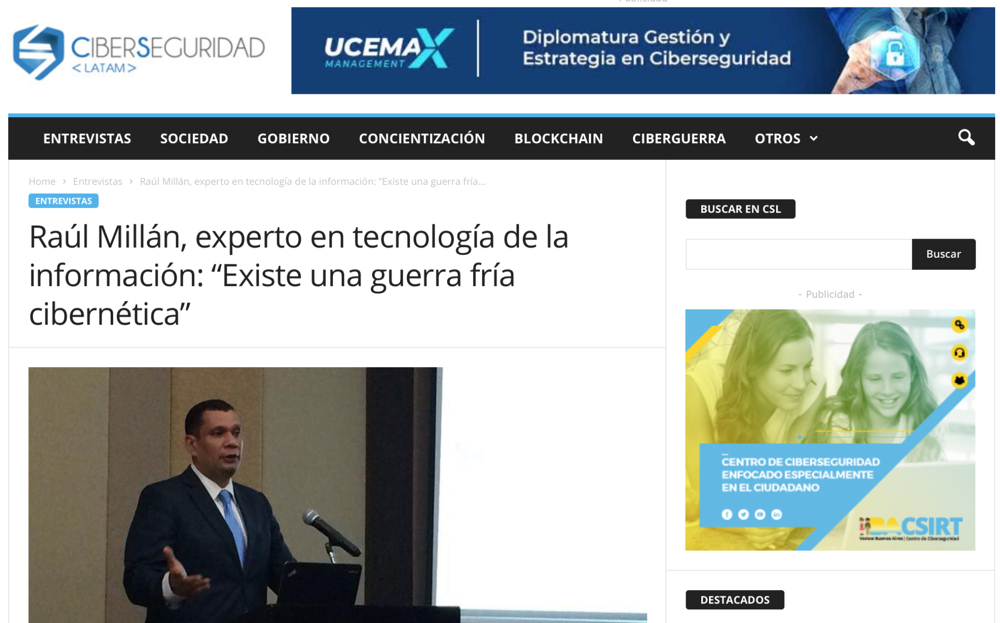

En días pasados me realizaron una entrevista sobre seguridad cibernética en el sitio [http://www.ciberseguridadlatam.com](http://www.ciberseguridadlatam.com). Aquí les comparto el enlace a dicho articulo.

[https://www.ciberseguridadlatam.com/2019/03/27/raul-millan-experto-en-tecnologia-de-la-informacion-existe-una-guerra-fria-cibernetica/](https://www.ciberseguridadlatam.com/2019/03/27/raul-millan-experto-en-tecnologia-de-la-informacion-existe-una-guerra-fria-cibernetica/)

