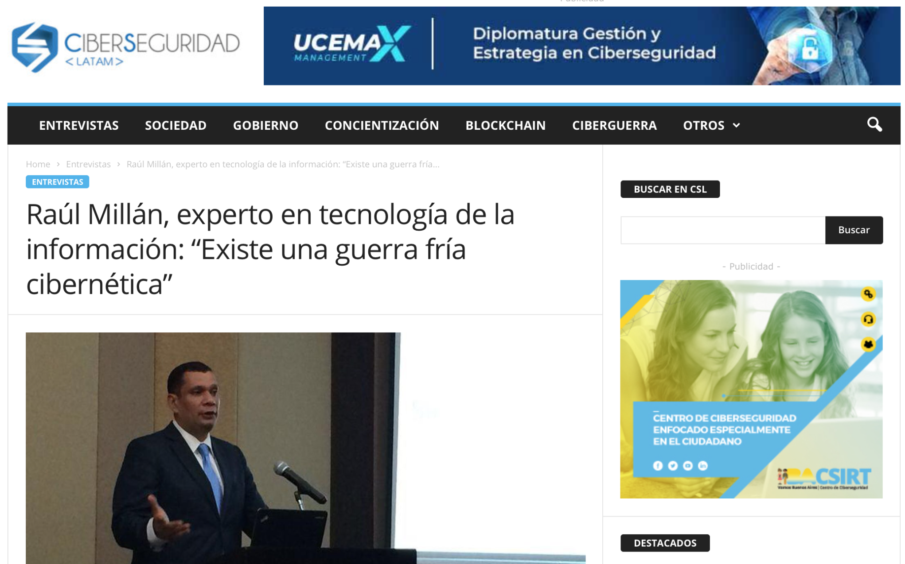

Recently, I was interviewed about cybersecurity on the site [http://www.ciberseguridadlatam.com](http://www.ciberseguridadlatam.com). Here I share the link to that article.

[https://www.ciberseguridadlatam.com/2019/03/27/raul-millan-experto-en-tecnologia-de-la-informacion-existe-una-guerra-fria-cibernetica/](https://www.ciberseguridadlatam.com/2019/03/27/raul-millan-experto-en-tecnologia-de-la-informacion-existe-una-guerra-fria-cibernetica/)
