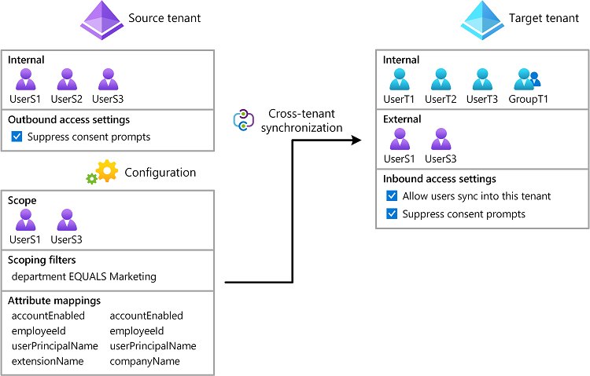

Microsoft ha anunciado recientemente el lanzamiento de una nueva característica entre tenants para su popular plataforma de productividad basada en la nube, Microsoft 365. Esta característica permite a los usuarios compartir contenido y colaborar con usuarios externos en diferentes tenant, rompiendo las barreras de colaboración y productividad entre diferentes tenants de la misma organización.

La función entre usuarios admite el uso compartido de archivos y carpetas almacenados en Microsoft OneDrive y SharePoint Online con usuarios externos. Esto permite a las empresas compartir información fácilmente con sus clientes, socios y proveedores, sin tener que preocuparse por las limitaciones de la colaboración tradicional específica de tenant. Los usuarios externos reciben un enlace seguro y encriptado al contenido compartido, al que se puede acceder desde cualquier dispositivo.

Uno de los beneficios clave de la función de sincronización cross-tenant es que elimina la necesidad de soluciones alternativas complejas que antes se requerían para la colaboración externa. Con esta característica, las empresas pueden compartir información rápida y fácilmente con usuarios externos, sin tener que preocuparse por establecer configuraciones de uso compartido complejas o protocolos de seguridad. Esto significa que las empresas pueden concentrarse en sus actividades principales, en lugar de dedicar tiempo a tareas administrativas.

También se mejora la seguridad y el cumplimiento. Microsoft ha incorporado sólidas medidas de seguridad para garantizar que todos los datos compartidos a través de esta función estén protegidos y cumplan con los estándares de la industria. Los usuarios externos tienen acceso de solo lectura al contenido compartido, lo que ayuda a garantizar que la información confidencial permanezca segura.

En conclusión, la nueva característica de usuarios cruzados de Microsoft cambia las reglas del juego para las empresas que buscan mejorar su colaboración y eficiencia. Con su facilidad de uso, medidas de seguridad y cumplimiento mejorado.

Pueden leer más sobre en el siguiente URL: [https://learn.microsoft.com/en-us/azure/active-directory/multi-tenant-organizations/cross-tenant-synchronization-overview](https://learn.microsoft.com/en-us/azure/active-directory/multi-tenant-organizations/cross-tenant-synchronization-overview)
