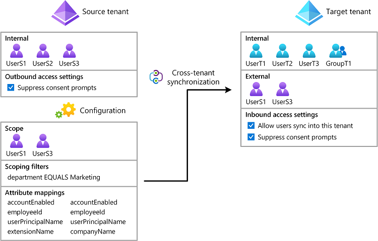

Microsoft has recently announced the launch of a new cross-tenant feature for its popular cloud-based productivity platform, Microsoft 365. This feature allows users to share content and collaborate with external users in different tenants, breaking down collaboration and productivity barriers between different tenants of the same organization.

The cross-tenant feature supports sharing files and folders stored in Microsoft OneDrive and SharePoint Online with external users. This enables businesses to easily share information with their customers, partners, and suppliers without having to worry about traditional tenant-specific collaboration limitations. External users receive a secure and encrypted link to the shared content that can be accessed from any device.

One of the key benefits of the cross-tenant synchronization feature is that it eliminates the need for complex workarounds that were previously required for external collaboration. With this feature, businesses can quickly and easily share information with external users without having to worry about setting up complex sharing configurations or security protocols. This means that businesses can focus on their core activities instead of spending time on administrative tasks.

Security and compliance are also improved. Microsoft has incorporated robust security measures to ensure that all data shared through this feature is protected and complies with industry standards. External users have read-only access to shared content, which helps ensure that sensitive information remains secure.

In conclusion, Microsoft's new cross-tenant user feature is a game-changer for businesses looking to improve collaboration and efficiency. With its ease of use, security measures, and improved compliance.

You can read more about it at the following URL: [https://learn.microsoft.com/en-us/azure/active-directory/multi-tenant-organizations/cross-tenant-synchronization-overview](https://learn.microsoft.com/en-us/azure/active-directory/multi-tenant-organizations/cross-tenant-synchronization-overview)
