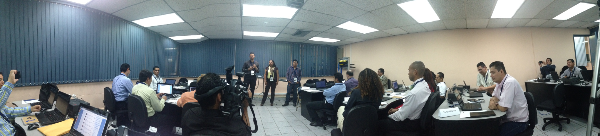
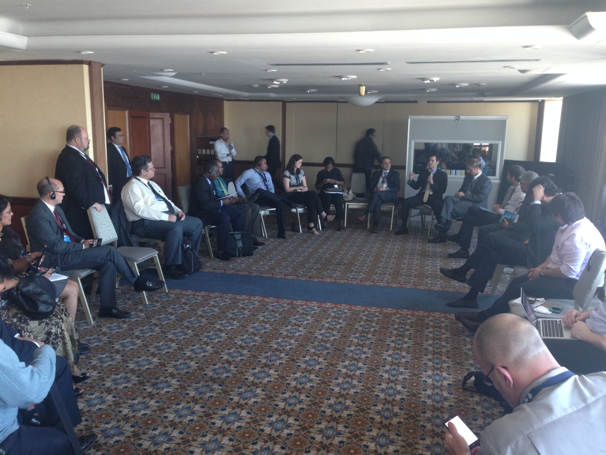
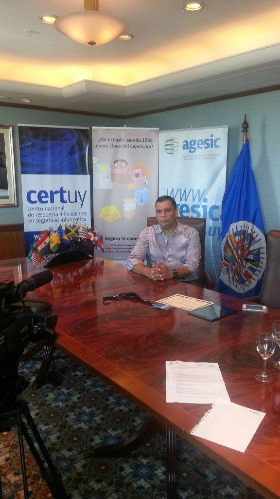
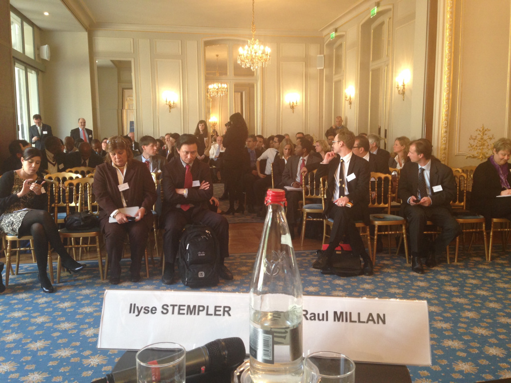
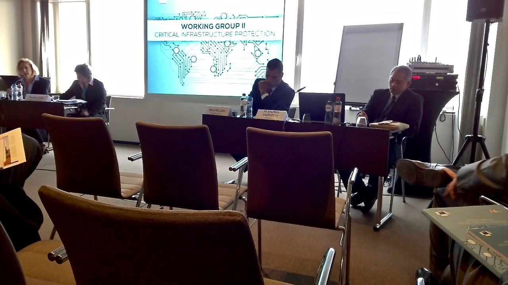
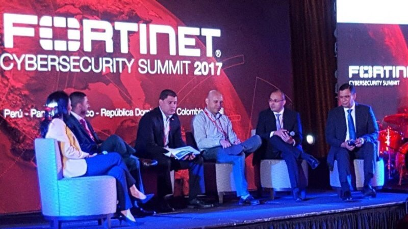

### 2013

* **130424** – Organizador – Ejercicio de Gestión de Crisis Cibernética – Simulacro de Ataques a Infraestructuras Críticas Nacionales – Organización de Estados Americanos. Panamá.

* **130624** – Ejercicio Regional sobre el Manejo de Incidentes Cibernéticos, mesa redonda discutiendo el tema de “Seguridad Cibernética y sus Implicaciones sobre la Economía y el Sector Financiero”, y SEGUNRINFO. Organización de Estados Americanos. Washington, D.C.
* **130916** – Panelista – McAfee Security Summit 2013. Ciudad de Panamá.
* **131015** – Expositor – Simposio “Delitos informáticos en Panamá” -Universidad Tecnológica de Panamá.

 | 

* **131111** – Panelista – Simposio Regional de Seguridad Cibernética. Organización de Estados Americanos – Motevideo, Uruguay.

### 2014

* **140314** – Expositor – Cyber capacity building as a development issue: What role for regional organisations? –  European Union Institute for Security Studies – Paris, Francia.

* **140429** – Expositor y organizador – “Segurinfo Panamá 2014” – Ciudad de Panamá.
* **140922** – Instructor – Cyber Security Capacity Building – National Cyber Security Technical Assistance Mission – Organización de Estados Americanos – St. Kitts and Neves.

### 2015

* **150223** – Panelista – Cyber NEEDS and development: identifying the needs of Networks Enhancing the Economy, Development and Security (NEEDS) –   European Union Institute for Security Studies – Bruselas, Belgica.

  
### 2016

* **160218** – Panelista – Desayuno Mensual CAPATEC: Panel de expertos “CIBERSEGURIDAD” – Panamá.
* **160513** – Panelista – Cybercrime, crypto currency and its real world effects – 19th ANNUAL IBA TRANSNATIONAL CONFERENCE – Panamá
* **160526** – Expositor – “Cómo es la vida de un CISO” – Tech Day Panamá 2016
* **161019** – Expositor – Seminario “La Ciberseguridad en Infraestructuras Críticas” – Buenos Aires, Argentina.
* **161108** – Panelista – “Segurinfo Panamá 2016″

### 2017

* **170316** – Panelista – PANEL: CYBER SECURITY FOR CRITICAL INFRASTRUCTURE – Cybertech Panamá.
* **170419** – Expositor – Checkpoint Experience 2017 – Checkpoint Software Technologies – Las Vegas, Nevada – EEUU.
* **170727** – Panelista – Fortinet CyberSecurity Summit (FCS17) – Panel: La Nueva Era de la Ciberseguridad – Fortinet – Ciudad de Panamá.
* **170805** – Panelista – “Gobernanza de Internet, Ciberseguridad e IoT” – Internet Society – Capitulo de Panamá.

* **170914** – Expositor – Subregional Workshop on Protection of Critical Infrastructure: Cybersecurity and Border Protection – Organización de Estados Americanos – Ciudad de Panamá
* **170928** – Expositor – Retos de la Seguridad en la Transformación Digital en Panamá – Ciudad de Panamá.
* **170930** – Panelista – Pasado, presente y futuro del IPv6 en Panamá – Internet Society – Capitulo de Panamá.
* **171024** – Panelista – 1er Foro sobre la Gobernanza de Internet – Panel No. 2: Seguridad en el entorno Digital – Panamá 2017

### 2019

* **190522** – Panelista – “Internet, más que las redes sociales” – IPANDETEC – Ciudad de Panamá.
* **190624** – Panelista – “Biometría e Integridad de Datos Personales” – II Foro de Gobernanza de Internet (IGF)- Ciudad de Panamá.