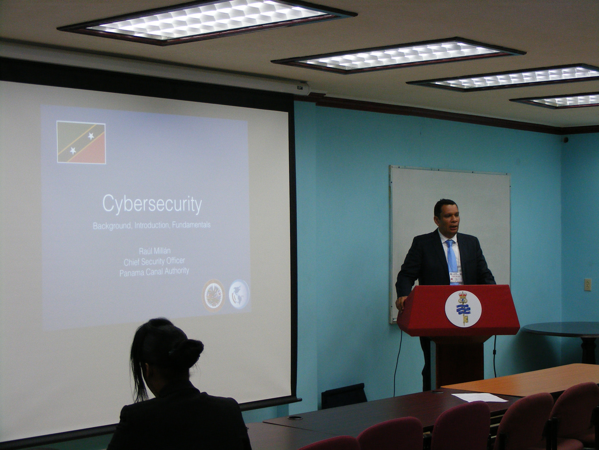
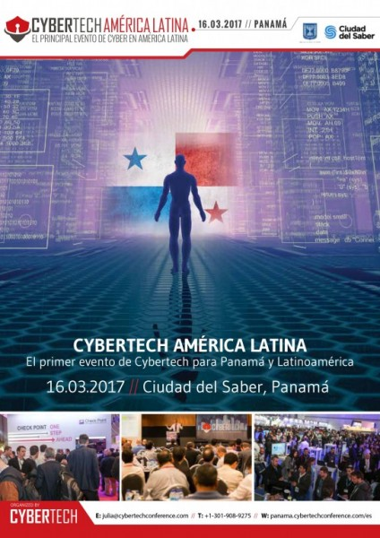

### 2013

* **130424** – Organizador – [Ejercicio de Gestión de Crisis Cibernética – Simulacro de Ataques a Infraestructuras Críticas Nacionales](https://www.mire.gob.pa/index.php/es/noticias-mire/6326-) – Organización de Estados Americanos. Panamá.

* **130624** – [Ejercicio Regional sobre el Manejo de Incidentes Cibernéticos, mesa redonda discutiendo el tema de “Seguridad Cibernética y sus Implicaciones sobre la Economía y el Sector Financiero”, y SEGUNRINFO](https://www.oas.org/es/centro_noticias/comunicado_prensa.asp?sCodigo=C-249/13). Organización de Estados Americanos. Washington, D.C.
* **130916** – Panelista – [McAfee Security Summit 2013](https://cert.pa/2013/09/aig-presente-en-simposio-sobre-seguridad-cibernetica/). Ciudad de Panamá.
* **131015** – Expositor – [Simposio “Delitos informáticos en Panamá”](https://cert.pa/2013/09/aig-presente-en-simposio-sobre-seguridad-cibernetica/) -Universidad Tecnológica de Panamá.
* **131111** – Panelista – [Simposio Regional de Seguridad Cibernética](https://www.presidencia.gub.uy/comunicacion/comunicacionnoticias/apertura-simposio-regional-cibernetico). Organización de Estados Americanos – Motevideo, Uruguay.

### 2014

* **140314** – Expositor – [Cyber capacity building as a development issue: What role for regional organisations?](https://www.iss.europa.eu/content/cyber-capacity-building-development-issue-what-role-regional-organisations) –  European Union Institute for Security Studies – Paris, Francia.

* **140429** – Expositor y organizador – [“Segurinfo Panamá 2014”](https://www.tvn-2.com/tecnologia/Panama-sede-Feria-Seguridad-Informacion_0_3919858033.html) – Ciudad de Panamá.
* **140922** – Instructor – [Cyber Security Capacity Building – National Cyber Security Technical Assistance Mission](https://www.sites.oas.org/cyber/EN/Pages/Events/eventsdet.aspx?docid=13) – Organización de Estados Americanos – St. Kitts and Neves.

### 2015

* **150223** – Panelista – [Cyber NEEDS and development: identifying the needs of Networks Enhancing the Economy, Development and Security (NEEDS)](https://www.iss.europa.eu/content/cyber-needs-and-development-identifying-needs-networks-enhancing-economy-development-and) –   European Union Institute for Security Studies – Bruselas, Belgica.

  
### 2016

* **160218** – Panelista – [Desayuno Mensual CAPATEC: Panel de expertos “CIBERSEGURIDAD”](https://capatec.org.pa/) – Panamá.
* **160513** – Panelista – [Cybercrime, crypto currency and its real world effects](https://www.int-bar.org/Conferences/conf674/binary/TransnationalCrimePanama2016_programme.pdf) – [19th ANNUAL IBA TRANSNATIONAL CONFERENCE](https://www.ibanet.org/Article/NewDetail.aspx?ArticleUid=eca0f7a0-1e97-4c3b-88d1-c2981ee9f14b) – Panamá
* **160526** – Expositor – [“Cómo es la vida de un CISO”](https://revistaitnow.com/tech-day-ciso-el-senor-de-los-controles/) – [Tech Day Panamá 2016](https://revistaitnow.com/tech-day-siga-minuto-a-minuto-el-evento-en-panama/)
* **161019** – Expositor – Seminario [“La Ciberseguridad en Infraestructuras Críticas”](https://revistaitnow.com/tech-day-siga-minuto-a-minuto-el-evento-en-panama/) – Buenos Aires, Argentina.
* **161108** – Panelista – [“Segurinfo Panamá 2016″](http://www.innovacion.gob.pa/noticia/2826)

### 2017

* **170316** – Panelista – [PANEL: CYBER SECURITY FOR CRITICAL INFRASTRUCTURE](http://panama.cybertechconference.com/program) – Cybertech Panamá.

* **170419** – Expositor – Checkpoint Experience 2017 – Checkpoint Software Technologies – Las Vegas, Nevada – EEUU.
* **170727** – Panelista – [Fortinet CyberSecurity Summit (FCS17)](https://fcslatam.com/pa) – Panel: La Nueva Era de la Ciberseguridad – Fortinet – Ciudad de Panamá.

* **170805** – Panelista – [“Gobernanza de Internet, Ciberseguridad e IoT”](https://www.isoc.org.pa/noticias/ciberseguridad/) – Internet Society – Capitulo de Panamá.
* **170914** – Expositor – [Subregional Workshop on Protection of Critical Infrastructure: Cybersecurity and Border Protection](https://www.sites.oas.org/cyber/EN/Pages/Events/eventsdet.aspx?docid=99) – Organización de Estados Americanos – Ciudad de Panamá
* **170928** – Expositor – [Retos de la Seguridad en la Transformación Digital en Panamá](https://meetings.vtools.ieee.org/m/46851) – Ciudad de Panamá.
* **170930** – Panelista – [Pasado, presente y futuro del IPv6 en Panamá](https://www.isoc.org.pa/noticias/pasado-presente-futuro-del-ipv6-panama/) – Internet Society – Capitulo de Panamá.
* **171024** – Panelista – [1er Foro sobre la Gobernanza de Internet](http://www.igfpanama.pa/agenda/) – Panel No. 2: Seguridad en el entorno Digital – Panamá 2017

### 2019

* **190522** – Panelista – [“Internet, más que las redes sociales”](https://www.ipandetec.org/events/internet-mas-que-las-redes-sociales/) – IPANDETEC – Ciudad de Panamá.
* **190624** – Panelista – [“Biometría e Integridad de Datos Personales”](Biometría e Integridad de Datos Personales) – II Foro de Gobernanza de Internet (IGF)- Ciudad de Panamá.