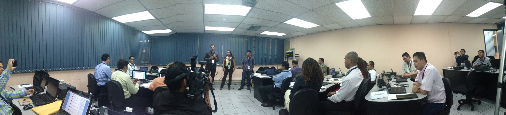
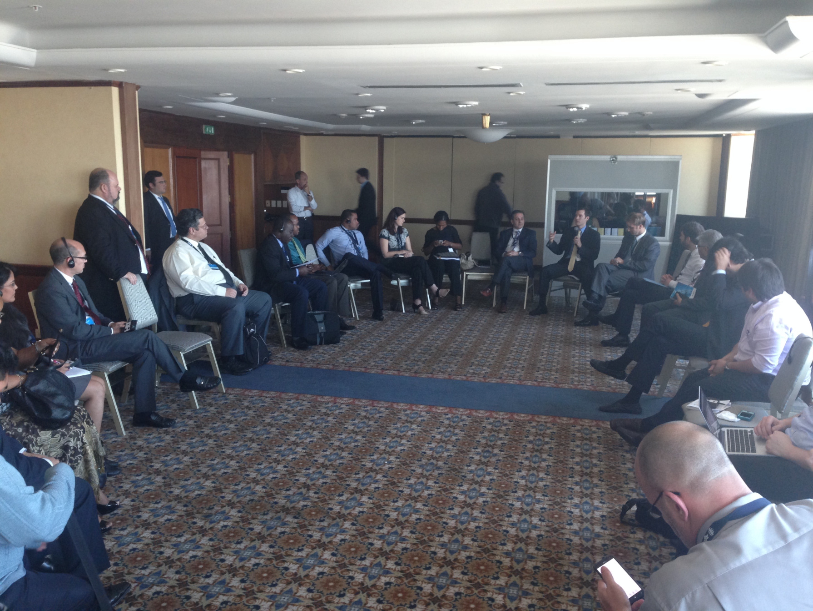
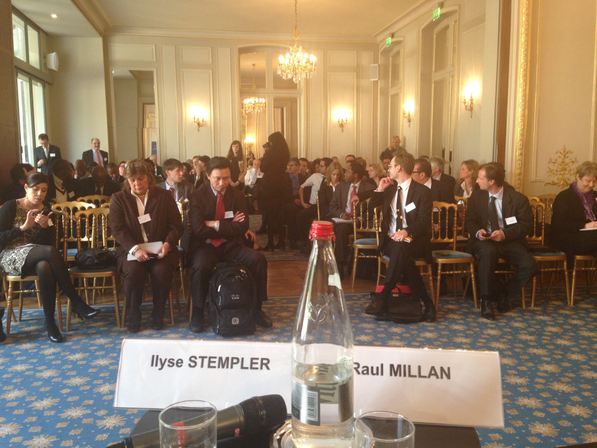
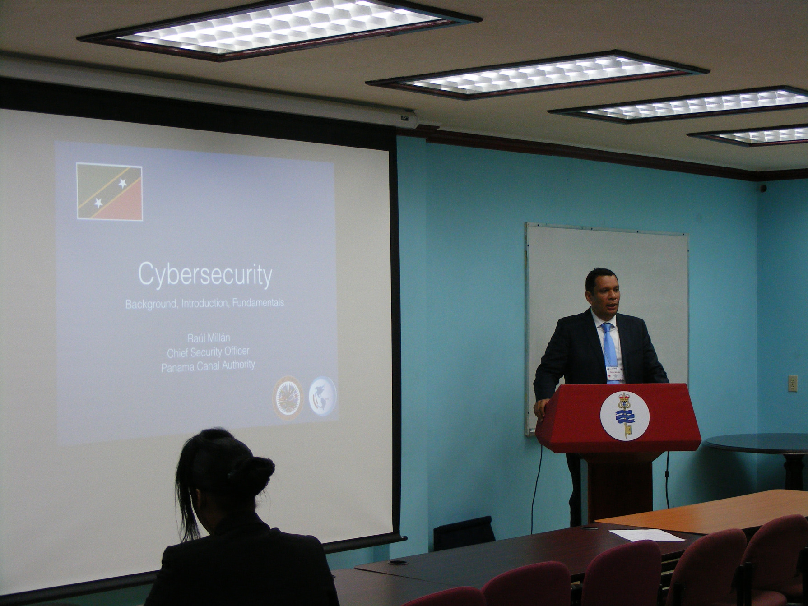
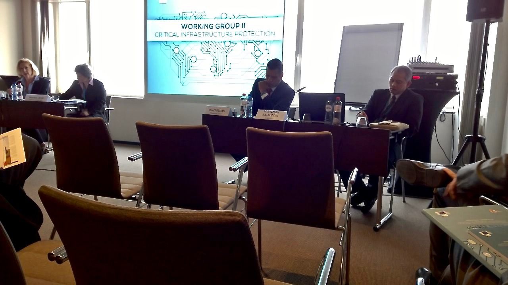
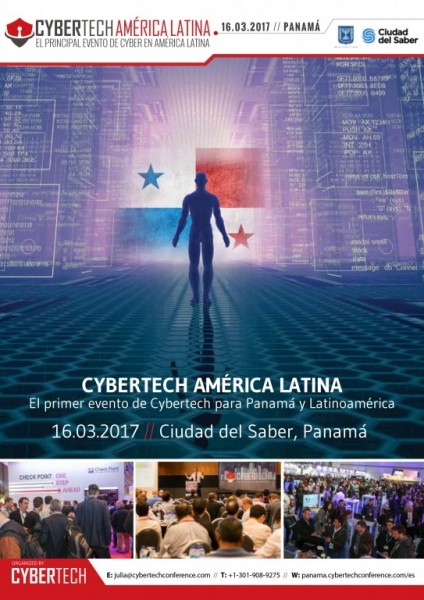
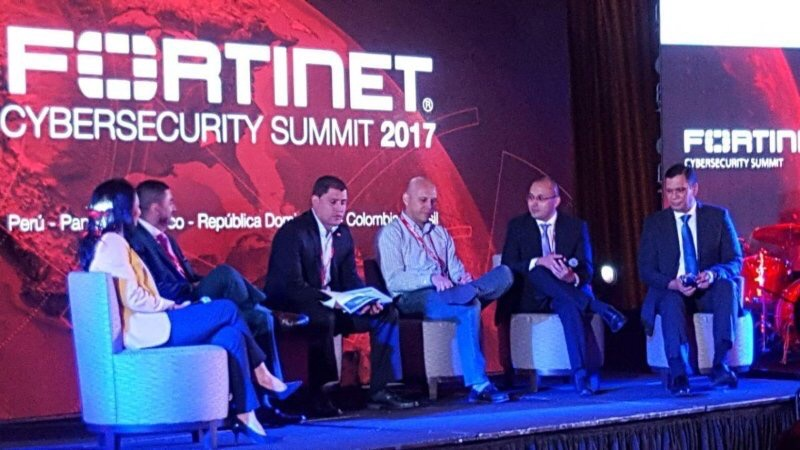

### 2013

* **130424** – Organizer – [Cybercrime Crisis Management Exercise – National Critical Infrastructure Attack Simulation](https://www.mire.gob.pa/index.php/es/noticias-mire/6326-) – Organization of American States. Panama.

* **130624** – [Regional Cybercrime Incident Management Exercise, Round Table on “Cybersecurity and Its Implications for the Economy and Financial Sector”, and SEGUNRINFO](https://www.oas.org/es/centro_noticias/comunicado_prensa.asp?sCodigo=C-249/13). Organization of American States. Washington, D.C.
* **130916** – Panelist – [McAfee Security Summit 2013](https://cert.pa/2013/09/aig-presente-en-simposio-sobre-seguridad-cibernetica/). Panama City.
* **131015** – Speaker – [Symposium “Cybercrime in Panama”](https://cert.pa/2013/09/aig-presente-en-simposio-sobre-seguridad-cibernetica/) - Technological University of Panama.
* **131111** – Panelist – [Regional Cybersecurity Symposium](https://www.presidencia.gub.uy/comunicacion/comunicacionnoticias/apertura-simposio-regional-cibernetico). Organization of American States – Montevideo, Uruguay.

### 2014

* **140314** – Speaker – [Cyber capacity building as a development issue: What role for regional organisations?](https://www.iss.europa.eu/content/cyber-capacity-building-development-issue-what-role-regional-organisations) –  European Union Institute for Security Studies – Paris, France.

* **140429** – Speaker and organizer – [“Seguninfo Panama 2014”](https://www.tvn-2.com/tecnologia/Panama-sede-Feria-Seguridad-Informacion_0_3919858033.html) – Panama City.
* **140922** – Instructor – [Cyber Security Capacity Building – National Cyber Security Technical Assistance Mission](https://www.sites.oas.org/cyber/EN/Pages/Events/eventsdet.aspx?docid=13) – Organization of American States – St. Kitts and Nevis.

### 2015

* **150223** – Panelist – [Cyber NEEDS and development: identifying the needs of Networks Enhancing the Economy, Development and Security (NEEDS)](https://www.iss.europa.eu/content/cyber-needs-and-development-identifying-needs-networks-enhancing-economy-development-and) –   European Union Institute for Security Studies – Brussels, Belgium.

  
### 2016

* **160218** – Panelist – [CAPATEC Monthly Breakfast: Expert Panel “CYBERSECURITY”](https://capatec.org.pa/) – Panama.
* **160513** – Panelist – [Cybercrime, crypto currency and its real world effects](https://www.int-bar.org/Conferences/conf674/binary/TransnationalCrimePanama2016_programme.pdf) – [19th ANNUAL IBA TRANSNATIONAL CONFERENCE](https://www.ibanet.org/Article/NewDetail.aspx?ArticleUid=eca0f7a0-1e97-4c3b-88d1-c2981ee9f14b) – Panama
* **160526** – Speaker – [“What It's Like to Be a CISO”](https://revistaitnow.com/tech-day-ciso-el-senor-de-los-controles/) – [Tech Day Panama 2016](https://revistaitnow.com/tech-day-siga-minuto-a-minuto-el-evento-en-panama/)
* **161019** – Speaker – Seminar [“Cybersecurity in Critical Infrastructure”](https://revistaitnow.com/tech-day-siga-minuto-a-minuto-el-evento-en-panama/) – Buenos Aires, Argentina.
* **161108** – Panelist – [“Seguninfo Panama 2016”](http://www.innovacion.gob.pa/noticia/2826)

### 2017

* **170316** – Panelist – [PANEL: CYBER SECURITY FOR CRITICAL INFRASTRUCTURE](http://panama.cybertechconference.com/program) – Cybertech Panama.

* **170419** – Speaker – Checkpoint Experience 2017 – Checkpoint Software Technologies – Las Vegas, Nevada – USA.
* **170727** – Panelist – [Fortinet CyberSecurity Summit (FCS17)](https://fcslatam.com/pa) – Panel: The New Era of Cybersecurity – Fortinet – Panama City.

* **170805** – Panelist – [“Internet Governance, Cybersecurity and IoT”](https://www.isoc.org.pa/noticias/ciberseguridad/) – Internet Society – Panama Chapter.
* **170914** – Speaker – [Subregional Workshop on Protection of Critical Infrastructure: Cybersecurity and Border Protection](https://www.sites.oas.org/cyber/EN/Pages/Events/eventsdet.aspx?docid=99) – Organization of American States – Panama City
* **170928** – Speaker – [Security Challenges in Digital Transformation in Panama](https://meetings.vtools.ieee.org/m/46851) – Panama City.
* **170930** – Panelist – [Past, Present and Future of IPv6 in Panama](https://www.isoc.org.pa/noticias/pasado-presente-futuro-del-ipv6-panama/) – Internet Society – Panama Chapter.
* **171024** – Panelist – [1st Internet Governance Forum](http://www.igfpanama.pa/agenda/) – Panel No. 2: Security in the Digital Environment – Panama 2017

### 2019

* **190522** – Panelist – [“Internet, More Than Social Media”](https://www.ipandetec.org/events/internet-mas-que-las-redes-sociales/) – IPANDETEC – Panama City.
* **190624** – Panelist – [“Biometrics and Personal Data Integrity”](Biometría e Integridad de Datos Personales) – II Internet Governance Forum (IGF) - Panama City.

### 2020

* **201006** – Speaker – [4th Cybersecurity Forum “Connected for Security - A Shared Responsibility”](https://cert.pa/2020/10/iv-foro-de-ciberseguridad-conectados-por-la-seguridad-una-responsabilidad-de-todos/) - National Authority for Government Innovation - CSIRT Panama.